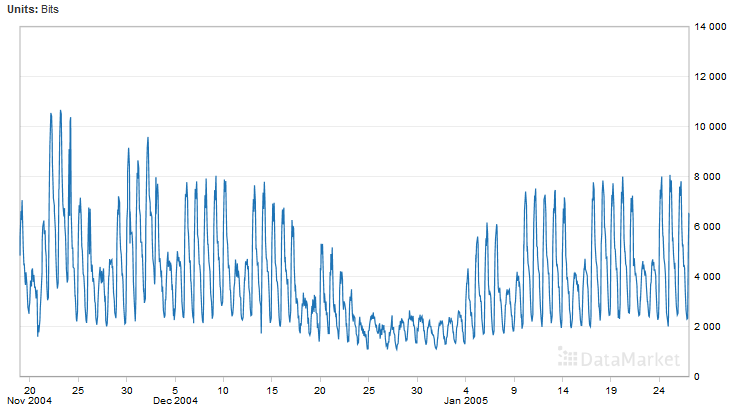

# timeseries anomaly detection

# Intro
The goal of this project is to experiment a software architecture to detect anomalies 
in timeseries data. 
Main concerns would include :
- timeseries data extraction
- prediction / anomaly detection model development and training

Here is a list of frameworks that may be of interest :
- [Deep Learning for Java](https://deeplearning4j.org/) : for building prediction / anomaly detection model
- [Spring Cloud Stream](https://cloud.spring.io/spring-cloud-stream/) : for building a data-driven architecture
- [Spring Cloud Data Flow](http://cloud.spring.io/spring-cloud-dataflow/) : for creating and orchestrating data pipelines 


# Exploring our dataset

The [dataset](https://datamarket.com/data/set/232g/internet-traffic-data-in-bits-from-an-isp-aggregated-traffic-in-the-united-kingdom-academic-network-backbone-it-was-collected-between-19-november-2004-at-0930-hours-and-27-january-2005-at-1111-hours-data-collected-at-five-minute-intervals#!ds=232g&display=line) used to experiment our architecture contains Internet traffic data (in bits) from an ISP.
Aggregated traffic in the United Kingdom academic network backbone. It was collected between 19 November 2004, at 09:30 hours and 27 January 2005, at 11:11 hours. Data collected at five minute intervals.




# Training the model

```shell
$ cd anomaly-detection-train
$ mvn spring-boot:run
```

So as to reuse trained model, two files are saved after the training process :

- anomaly-detection-network-model_<version>.zip : trained neural network model
- anomaly-detection-data-normalizer_<version> : data normalizer used for data engineering

See [dl4j - Saving and Loading a Neural Network](https://deeplearning4j.org/modelpersistence#saving-and-loading-a-neural-network), for details on saving and loading a neural network.

# Making prediction

## runing the application
```shell
$ cd anomaly-detection-predict
$ mvn spring-boot:run
```
## making prediction
```shell
$ curl http://localhost:8080/predict?value=2750.50 
$ 3244.099609375
```

# Build

```shell
$ mvn clean package
```
